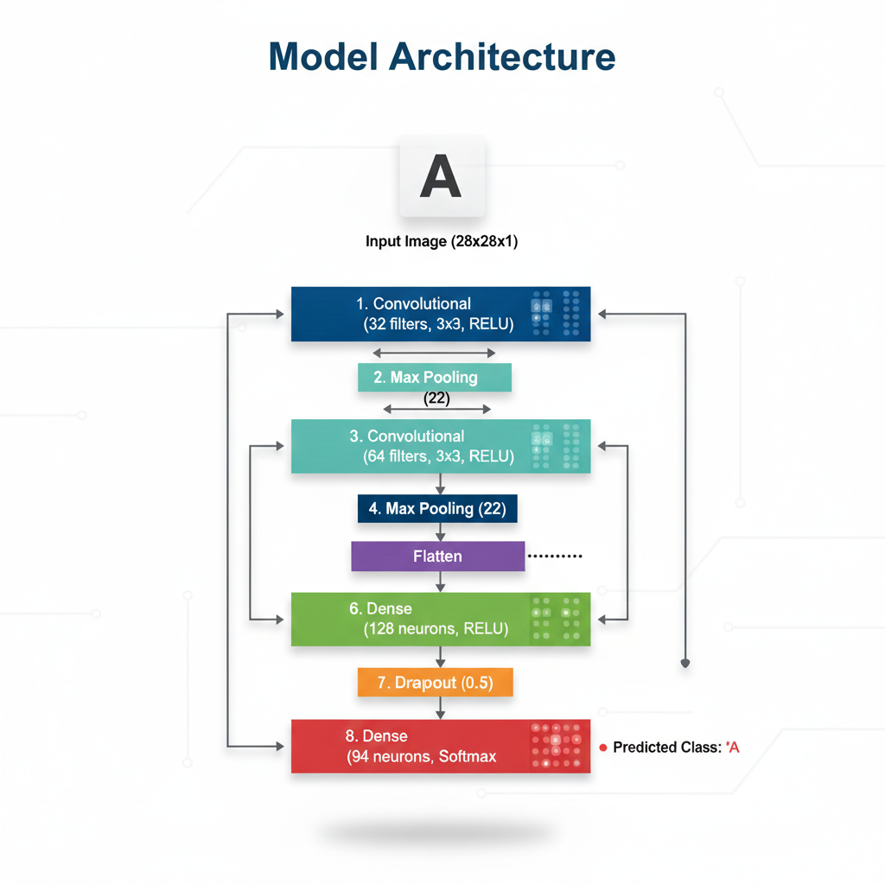

# Neural Network Character Recognition (TMNIST)

A deep learning implementation for multi-class classification of alphanumeric characters using the TMNIST (Typography MNIST) dataset. This project explores typeface-invariant character recognition using a custom-built Convolutional Neural Network (CNN) architecture.

## 📌 Project Overview
While the standard MNIST dataset focuses on handwritten digits, this project utilizes the **TMNIST (Typography MNIST)** dataset, which contains over 281,000 images representing 94 different characters across 2,990 Google Fonts. The objective was to develop a model robust enough to generalize across diverse font styles, weights, and glyph variations.

## 🛠 Tech Stack
* **Deep Learning Framework:** TensorFlow / Keras
* **Data Manipulation:** Pandas, NumPy
* **Visualization:** Matplotlib, Seaborn

## 🧠 Model Architecture
The project implements a Sequential Convolutional Neural Network designed to extract spatial hierarchies from grayscale images.

  
   
  <em>Neural Network Model Architecture</em>

| Layer | Type | Details |
| :--- | :--- | :--- |
| 1 | **Convolutional** | 32 filters, 3x3 Kernel, ReLU activation |
| 2 | **Max Pooling** | 2x2 Pool size |
| 3 | **Convolutional** | 64 filters, 3x3 Kernel, ReLU activation |
| 4 | **Max Pooling** | 2x2 Pool size |
| 5 | **Flatten** | Converts 2D feature maps to 1D vector |
| 6 | **Dense (Hidden)** | 128 neurons, ReLU activation |
| 7 | **Dropout** | Rate: 0.5 (to prevent overfitting) |
| 8 | **Dense (Output)** | 94 neurons (Softmax for multi-class classification) |

## 🚀 Methodology

### 1. Data Preprocessing & EDA
* **Normalization:** Pixel values were scaled from **0–255** to **0–1** to facilitate faster gradient descent convergence and stabilize training.
* **Reshaping:** Input data was reshaped to `(28, 28, 1)` to align with the standard 2D convolutional input requirements.
* **Label Encoding:** Categorical character labels were transformed into numerical format and processed via One-Hot Encoding for the output layer.

### 2. Training Strategy
* **Loss Function:** `categorical_crossentropy` used to measure the performance of the 94-class output.
* **Optimizer:** `Adam` (Adaptive Moment Estimation) for its efficient handling of sparse gradients and adaptive learning rate.
* **Regularization:** A Dropout layer (50%) was implemented before the output layer to reduce co-adaptation of neurons and mitigate overfitting.

## 📊 Key Results
* **High Generalization:** The model successfully learns features that are invariant to specific font families, identifying characters regardless of serif or sans-serif stylings.
* **Classification Performance:** Achieved high precision across alphanumeric classes, successfully differentiating between high-similarity pairs like 'O' vs '0' and 'I' vs '1' across varied typefaces.

---
*Developed by [Chinmay Kulkarni](https://github.com/ckulkarni13)*
